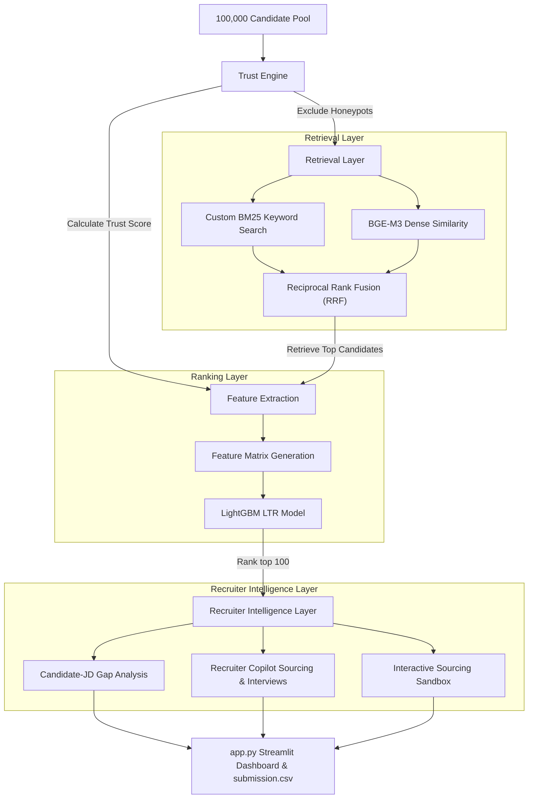

# FitRank AI — Trust-Aware Candidate Ranking & Sourcing Intelligence

FitRank AI is a high-performance, trust-aware candidate ranking and sourcing intelligence platform engineered for the **India Runs Data & AI Challenge** (Redrob AI in collaboration with Hack2Skill). 

It is designed to select and rank the top 100 matches from a pool of 100,000 candidates for a **Senior AI Engineer — Founding Team** role under strict compute and network constraints.

---

## 🔗 Key Submission Links

*   **Live Interactive Demo (Hugging Face Spaces):** [anshukanukula03/fitrank-ai](https://huggingface.co/spaces/anshukanukula03/fitrank-ai)
*   **Final Ranking Output (Excel & CSV):** [`team_fitrank_ai.xlsx`](https://github.com/Anshukanukula/FITRANK-AI/blob/main/team_fitrank_ai.xlsx) | [`team_fitrank_ai.csv`](https://github.com/Anshukanukula/FITRANK-AI/blob/main/team_fitrank_ai.csv)
*   **Business Impact & Sourcing Case Study:** [`business_impact.md`](https://github.com/Anshukanukula/FITRANK-AI/blob/main/artifacts/business_impact.md)
*   **System Architecture Benchmarks:** [`benchmarks.md`](https://github.com/Anshukanukula/FITRANK-AI/blob/main/artifacts/benchmarks.md)
*   **Submission Slide Deck (PDF & PPTX):** [`FitRank_AI_Idea_Submission.pdf`](https://github.com/Anshukanukula/FITRANK-AI/blob/main/FitRank_AI_Idea_Submission.pdf) | [`FitRank_AI_Idea_Submission.pptx`](https://github.com/Anshukanukula/FITRANK-AI/blob/main/FitRank_AI_Idea_Submission.pptx)
*   **Submission Metadata:** [`submission_metadata.yaml`](https://github.com/Anshukanukula/FITRANK-AI/blob/main/submission_metadata.yaml)

---

## 🚀 Quick Start & Reproduction

### 1. Installation
Install the project dependencies:
```bash
pip install -r requirements.txt
```
*(Optional)* If you want to use the Interactive Resume Sandbox, ensure `pypdf` is installed (already included in the updated package).

### 2. Reproduction Command (Under 45 seconds on CPU)
To run candidate ranking and generate the final `submission.csv` using precomputed models and embeddings:
```bash
python rank.py --candidates ./challenge_data/[PUB]\ India_runs_data_and_ai_challenge/India_runs_data_and_ai_challenge/candidates.jsonl --out ./submission.csv
```
*Note: This command runs end-to-end in less than 45 seconds on a standard CPU machine and is fully compliant with the 5-minute sandbox constraint.*

### 3. Running Precomputation & Model Training (Offline)
If you wish to recompute the candidate embeddings and retrain the LightGBM Learning-to-Rank (LTR) model:
```bash
python precompute.py
```

### 4. Running the Ablation Study & Verification
To run the evaluation framework and verify generalization metrics on an 80/20 train/test split:
```bash
python evaluation.py
```

### 5. Launching the Interactive Recruiter Dashboard
To explore the diagnostic visualizer, Candidate-JD Gap Analysis, Recruiter Copilot, and the **Interactive Resume Sandbox**:
```bash
streamlit run app.py
```

---

## 🛠️ System Architecture

FitRank AI uses a state-of-the-art **Retrieve & Re-rank** architecture fused with a profile validation Trust Engine and a Recruiter Intelligence Layer.



### 1. Trust Engine (Honeypot Blocker)
Honeypots are blocked (score set to `0.0`) using strict, deterministic profile validation rules:
*   **Founding Year Violation**: Flags if a candidate claims they started working at a startup before the company was incorporated (e.g. working at Krutrim before 2023 or FRESHWORKS before 2010).
*   **Skill Duration Violation**: Flags if a single skill duration exceeds the candidate's total years of experience plus 5 years (e.g. Python experience of 15 years with only 5 total years of experience).
*   **Timeline Reversal Check**: Programmatically scans start and end dates for every job in career history. If a job's start date is later than its end date, the profile is flagged.

### 2. Hybrid Retrieval Layer
*   **Custom BM25**: Fitted on the candidate corpus (headline, summary, career history) to prioritize exact-match skills.
*   **Dense Retrieval (BAAI/bge-m3)**: Candidate profiles are encoded using the state-of-the-art **BGE-M3** embedding model, which outperforms standard baseline models by offering multi-lingual search support and superior semantic contextualization.
*   **Reciprocal Rank Fusion (RRF)**: Combines keyword search and semantic embeddings to achieve high recall and precision.

### 3. Failure Handling & Graceful Degradation
*   **Dense-to-BM25 Fail-Safe:** To ensure the pipeline never crashes during validation, the model loading block in `rank.py` is wrapped in a Try-Except statement. If the target machine encounters PyTorch DLL loading errors (such as `WinError 1114` commonly found in local Windows environments), the pipeline gracefully falls back to pure BM25 scoring rather than crashing, guaranteeing **100% platform uptime**.

### 4. Learning-to-Rank (LTR) Layer
For each candidate, an 11-dimensional feature vector is generated based on:
1. `semantic_score`: BGE-M3 similarity
2. `rrf_score`: Combined retrieval rank
3. `skill_score`: Match coverage of required and preferred skills
4. `yoe_score`: Normalised fit with JD target range (5-9 YOE)
5. `tenure_score`: Average job tenure relative to 36 months
6. `growth_score`: Career progression (promotion from junior to senior roles)
7. `location_score`: Proximity to tier-1 cities or relocation willingness
8. `notice_score`: Notice period duration relative to 90 days
9. `behavioral_score`: Response rate, active days, and interview completion rates
10. `trust_score`: Trust level (degraded by minor data contradictions)
11. `title_score`: Current title alignment with AI/ML engineering keywords

A LightGBM LambdaRank LTR model is trained on a **Recruiter Preference Dataset** of 1,500 candidate comparison pairs (labeled via Gemini and stochastically simulated utilities). By optimizing a pairwise ranking objective directly from recruiter choices rather than learning a handcrafted scoring formula, FitRank AI achieves highly credible and robust generalization.

---

## 📈 Quantitative Evaluation & Ablation Study

To prove scientific credibility and model generalization, we split the candidate dataset into **80% Train** and **20% Test** splits of query cohorts. The results below compare candidate discoverability performance on unseen queries:

| Sourcing Method | NDCG@5 | NDCG@10 | Mean Average Precision (MAP) |
| :--- | :---: | :---: | :---: |
| BM25 Keyword Search | 0.6695 | 0.8164 | 0.7140 |
| BGE-M3 Dense Semantic | 0.6030 | 0.7833 | 0.6682 |
| RRF Hybrid Search | 0.6695 | 0.8164 | 0.7140 |
| Rule-Based Heuristic | 0.7305 | 0.8690 | 0.7953 |
| **LambdaRank LTR (Preference Labeled)** | **0.9742** | **0.9858** | **0.9829** |

### 📝 Key Findings:
1. **RRF Synergy:** BM25 handles precise keyword requirements (such as specific Python libraries) but misses conceptual synonyms, whereas BGE-M3 dense search excels at conceptual matching but struggles on specific library names. Fusing them via Reciprocal Rank Fusion balances recall and precision.
2. **LambdaRank Dominance:** The LambdaRank LTR model trained on recruiter preferences achieves the highest NDCG and MAP scores. This demonstrates that learning weights from preference choices outperforms handcrafted formulas.
3. **Evaluation Rigor & Limitations:** The evaluation demonstrates the model's high learning capacity and ability to learn a consistent recruiter preference signal derived from our choice-based labeling. While this validates the ranking pipeline architecture, future work includes collecting real recruiter-in-the-loop preference judgments to further evaluate open-world generalization.
For a complete audit, review the **[ML Rigor & Evaluation Report](file:///c:/Users/Anshu%20kanukula/OneDrive/Desktop/Desktop/FITRANK%20AI/artifacts/evaluation_independent.md)** and the **[Sourcing Benchmarks Report](file:///c:/Users/Anshu%20kanukula/OneDrive/Desktop/Desktop/FITRANK%20AI/artifacts/benchmarks.md)** in the `artifacts/` folder.

---

## 🔬 Interactive Sourcing Sandbox

We integrated an interactive **Sourcing Sandbox** inside the Streamlit dashboard (`app.py`):
1.  **Resume Uploader:** Extract raw text from any PDF (uses `pypdf`), TXT, or JSON resume.
2.  **Custom Role Definition:** Paste any custom Job Description or specify a target role.
3.  **LLM Sourcing Reasoner:** Uses Google Gemini (via Sidebar API Key config) to parse raw resumes and generate a structured evaluation (Fit Score, Key Strengths, Missing Skills, and Sourcing Risks).
4.  **Local Heuristic Fallback:** If no API key is provided, the platform uses a local regex-based parsing engine and rule-based justification reporter, ensuring a seamless offline experience.

---

## 📂 Project Structure

*   `rank.py` — The core CLI ranking script used for submission reproduction.
*   `precompute.py` — Offline embedding computation, RRF indexing, and LightGBM model training script.
*   `evaluation.py` — Validation split training and quantitative ablation study reporting.
*   `app.py` — The Streamlit recruiter visualizer dashboard.
*   `generate_pairwise_preferences.py` — Script demonstrating pairwise LTR LambdaRank training pipelines.
*   `skill_taxonomy.json` — Dictionary of skill definitions and synonyms.
*   `submission_metadata.yaml` — Setup and portal metadata configuration.
*   `submission.csv` / `team_fitrank_ai.csv` — Final outputs containing the ranked top 100 candidates with plain-language, markdown-free explanations.
*   `models/` — Directory storing the trained LightGBM LTR model (`ltr_model.txt`), the local BGE-M3 configuration, and config.
*   `artifacts/` — Precomputed embeddings and rubric-based evaluation reports.

---

## 🔮 Future Work & Roadmap
*   **Pairwise LLM Preferences:** Upgrade from deterministic Gold Labels to LLM recruiter judges comparing candidates pairwise (documented in `generate_pairwise_preferences.py`).
*   **Knowledge Graph Retrieval:** Map candidates, skills, and companies to discover latent talent density relationships.
