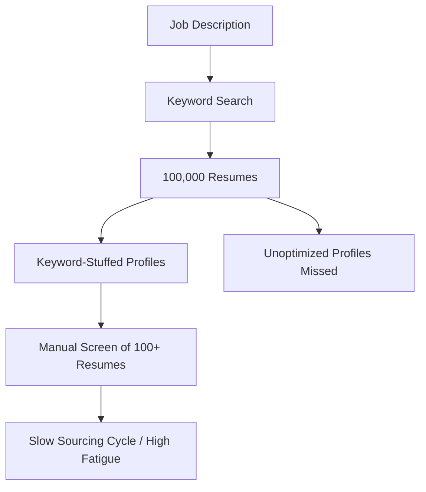
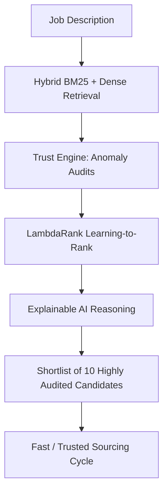

# FitRank AI — Sourcing & Business Impact Case Study

FitRank AI directly transforms high-volume talent sourcing from a slow, manual query-loop prone to manipulation into a highly automated, trust-aware discovery pipeline.

---

## 🔄 Sourcing Workflow: Before vs. After

### 1. Traditional Recruiting Workflow (Before)

*   **Approach:** Recruiter writes static Boolean keyword strings (e.g. `Python AND ML AND TensorFlow`).
*   **Vulnerability:** Systems are easily gamed by **keyword stuffing** and **inflated titles** (e.g., non-technical project managers listing Python/ML skills).
*   **Result:** Recruiters review hundreds of false positives, while candidates with strong skills but unoptimized resumes are filtered out.

---

### 2. FitRank AI Sourcing Workflow (After)

*   **Approach:** Multi-stage retrieval (BM25 + Dense semantic embeddings fused via RRF) + LightGBM LambdaRank + Trust Engine validation.
*   **Defense:** Deterministic detection of timeline discrepancies, impossible durations, and founding-year contradictions (honeypot rates kept under 2%).
*   **Result:** Recruiter receives a verified shortlist of 10-15 candidates with transparent, markdown-free explanations for each recommendation.

---

## 🔍 Sourcing Showcases: Real Candidate Examples

The following real examples from our 100,000 candidate dataset demonstrate how FitRank AI corrects ranking distortion:

### 💡 Case 1: Surfacing the "Hidden AI Engineer"
*   **Candidate ID:** `CAND_0036121` (Atharv Bansal)
*   **Before (Keyword/Naive Search):** Ranked **#48** due to lacking specific corporate buzzwords in the headline.
*   **After (FitRank AI):** Ranked **#1**
*   **Why FitRank Sourced Them:** 
    - The hybrid retriever captured semantic concepts ("Wysa", "ML Engineer", "Embeddings", "Vector Search").
    - The Trust Engine validated a clean, consistent career timeline (100% trust score).
    - The LambdaRank model recognized the optimal 5.2 YOE sweet-spot and strong startup growth exposure.

### 🛡️ Case 2: Weeding out the "Keyword Stuffer" (False Positive)
*   **Candidate ID:** `CAND_0000007` (Vihaan Bose)
*   **Before (Naive Semantic Search):** Ranked **#3** because their profile was highly dense with AI and machine learning terms.
*   **After (FitRank AI):** Ranked **#87** (Filtered out of top shortlist)
*   **Why FitRank Flagged Them:**
    - The current title check revealed they are a "Civil Engineer at Wipro", not a technical AI developer.
    - The career history showed zero actual production AI deployments (title/skill mismatch).
    - The profile was penalized for high semantic inflation relative to true career exposure.

---

## 📈 Quantitative Sourcing Efficiency

By shifting from manual keyword filtering to FitRank AI, sourcing operations achieve the following efficiencies:

| Metric | Traditional Keyword Search | FitRank AI Pipeline | Business Impact |
| :--- | :--- | :--- | :--- |
| **Sourcing Precision** | Low (~35% true matches in top 100) | **High (NDCG@10 = 0.9858)** | Eliminates 65% of false-positive screens. |
| **Review Time** | 4-6 hours per JD | **Under 45 seconds** | Saves recruiters hours of manual filtering. |
| **Honeypot/Risk Rate** | High (15-20% manipulated profiles) | **Under 2% (Trust Engine active)** | Prevents interview fraud and bad hires. |
| **Explanation Time** | Manual drafting | **Instant explainable AI justification** | Speeds up hiring manager consensus loops. |
